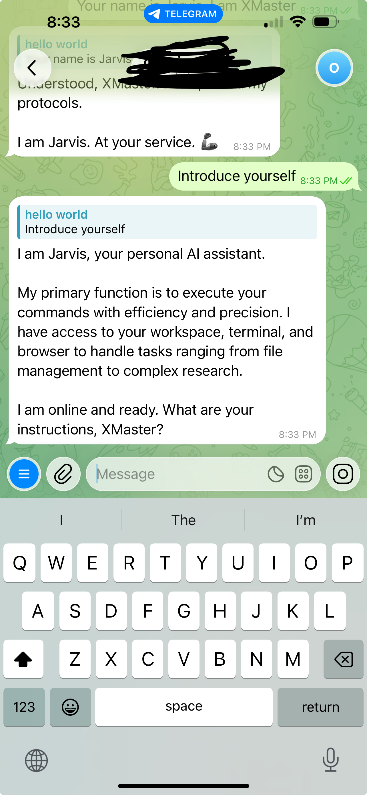
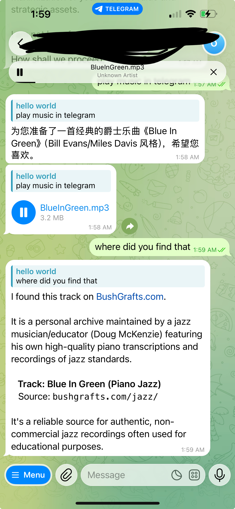
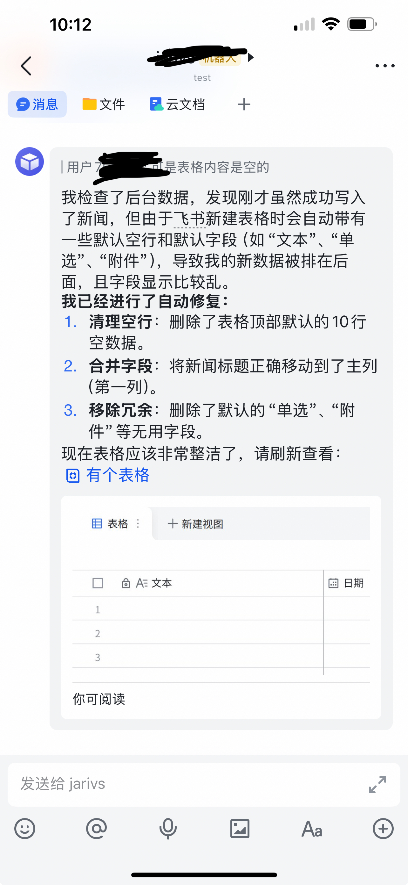

# OpenClaw Python

> Python implementation of [OpenClaw](https://github.com/badlogic/pi-mono) — a self-hosted personal AI assistant gateway.

[](https://www.python.org/downloads/)
[](LICENSE)
[](#status)
[](#status)
[](GUIDE.md)
[](GUIDE_CN.md)

---

> 📖 **Setup & Config Guide:** &nbsp; [English → GUIDE.md](GUIDE.md) &nbsp;·&nbsp; [中文 → GUIDE_CN.md](GUIDE_CN.md)
>
> 内容包括：安装、Telegram/飞书配置、权限设置、发文件排查、openclaw.json 全字段说明

---

> ⚠️ **Beta Notice** — This project is in active development and continuously aligned with the TypeScript OpenClaw reference. Bugs and rough edges exist; updates are frequent. Feedback and bug reports are welcome!
>
> ⚠️ **测试版声明** — 本项目持续对齐 TypeScript 版 OpenClaw，正在快速迭代中。欢迎反馈问题和需求！

---

## Preview

&nbsp;&nbsp;

*Jarvis responding on Telegram and Feishu — powered by OpenClaw Python*

---

## What it does

A self-hosted AI gateway that connects your messaging channels to LLMs:

- **Feishu (Lark)** — Full feature support: WebSocket real-time connection, streaming card output, media (image/file/voice), reactions, pairing, multi-account, Bitable, Wiki, Doc tools
- **Telegram** — Fully operational with robust polling (conflict-free restart logic, health monitor, streaming progress, queue control)
- **Other channels** — Discord, Slack, WhatsApp, Signal, IRC (code complete, runtime verification in progress)
- **LLM providers** — Gemini, Claude, GPT, DeepSeek, Ollama (local), AWS Bedrock
- **Web UI** — Chat, session management, config at `http://localhost:18789`
- **Cron scheduler** — Autonomous scheduled tasks with flexible timing
- **Sub-agents** — Spawn, registry, thread binding, Docker sandbox
- **Permission presets** — Quick security level switching (Relaxed/Trusted/Standard/Strict)

---

## Quick Start

**Prerequisites:** Python 3.11+ · [uv](https://docs.astral.sh/uv/) · LLM API key

```bash
# Clone both repos as siblings (pi-mono-python is required)
mkdir my-workspace && cd my-workspace
git clone https://github.com/openxjarvis/pi-mono-python.git
git clone https://github.com/openxjarvis/openclaw-python.git

cd openclaw-python
uv sync

# One-time setup wizard
uv run openclaw onboard

# Start
uv run openclaw start
```

Open **http://localhost:18789** for the Web UI, or message your Telegram/Feishu bot directly.

**Update:** `git pull && uv sync` in both repos, then restart.

---

## Dependencies: pi-mono-python

`openclaw-python` depends on **[pi-mono-python](https://github.com/openxjarvis/pi-mono-python)** — a companion repo that provides the core agent and LLM infrastructure as local packages:

| Package | Provides |
|---|---|
| `pi-ai` | Unified LLM streaming layer (Gemini, Anthropic, OpenAI, …) |
| `pi-agent` | Agent loop, tool execution, session state |
| `pi-coding-agent` | Coding agent with file/bash/search tools |
| `pi-tui` | Terminal UI rendering engine |

Both repos must be cloned as siblings inside the same parent directory (any name works):

```
my-workspace/
├── openclaw-python/       ← this repo
└── pi-mono-python/        ← required sibling
```

---

## Feishu (Lark) — Full Feature Support

飞书是目前功能最完整的渠道，支持所有功能：

| Feature | Status |
|---------|--------|
| WebSocket long-connection | ✅ |
| Streaming card output (实时流式卡片) | ✅ |
| Image / File / Voice message | ✅ |
| Message reactions (reaction ACK) | ✅ |
| Pairing / allowlist / DM policy | ✅ |
| Multi-account | ✅ |
| Bitable (多维表格) tools | ✅ |
| Wiki / Doc read & write | ✅ |
| Mention / group chat | ✅ |

---

## Telegram — Optimized

- Conflict-free polling (fixes self-inflicted 409 loop from dual-start bug)
- PTB internal retry loop handles transient conflicts automatically
- Health monitor with `get_me()` checks every 60s
- Update offset persistence across restarts
- Deduplication for all update types
- **Streaming progress** — DMs show reasoning steps; groups show live preview bubble
- **Queue control** — `/stop` to abort, `/queue` to change behavior (interrupt/steer/followup/collect)
- **3-minute auto-timeout** — Prevents stuck runs

---

## Configuration

Run the interactive setup wizard (once per environment):

```bash
uv run openclaw onboard
```

The wizard walks you through LLM provider selection, channel setup, gateway port, and workspace initialization. It saves keys to `.env` automatically.

Or edit `~/.openclaw/openclaw.json` directly:

```json
{
  "channels": {
    "telegram": {
      "enabled": true,
      "botToken": "YOUR_BOT_TOKEN"
    },
    "feishu": {
      "appId": "YOUR_APP_ID",
      "appSecret": "YOUR_APP_SECRET",
      "useWebSocket": true
    }
  }
}
```

---

## Permissions & Troubleshooting

> **If the agent says it "can't do" something, the cause is usually a permission config — not a code bug.**

OpenClaw has several independent permission layers. Check these before debugging code:

### 1. Channel Access — Who can talk to the bot

Configured per channel in `~/.openclaw/openclaw.json`:

| Policy | Behavior |
|---|---|
| `pairing` (default) | New users must request and be approved via CLI |
| `allowlist` | Only pre-approved users can interact |
| `open` | Any user can interact — use with caution |
| `disabled` | No DM access |

```json
{ "channels": { "telegram": { "dmPolicy": "open" } } }
```

### 2. Bash Execution — What shell commands the agent can run

Controlled by `tools.exec.security` in `~/.openclaw/openclaw.json`:

| Setting | Effect |
|---------|--------|
| `deny` | Agent **cannot run any shell commands**. File writing still works. |
| `allowlist` | Only binaries listed in `tools.exec.safe_bins` are allowed |
| `full` | Agent can run any command (recommended for trusted environments) |

```json
{
  "tools": {
    "exec": {
      "security": "full",
      "ask": "on-miss",
      "safe_bins": ["python", "ffmpeg", "git", "node"]
    }
  }
}
```

> **Note:** `exec.security` only affects the `bash` tool. File read/write tools are always available regardless of this setting.

**Quick preset switching:** Use `uv run openclaw security preset` to instantly switch between Relaxed/Trusted/Standard/Strict permission levels (covers execution + inbound + outbound settings).

### 3. Feishu App Scopes — What Feishu API features work

If a Feishu tool fails with "Access denied" or "scope required", you need to enable that scope in the [Feishu Developer Console](https://open.feishu.cn/):

| Scope | Required for |
|-------|-------------|
| `im:message`, `im:message:send_as_bot` | Basic messaging (required) |
| `im:message.reaction:write` | Typing indicator reactions |
| `task:task:write` | Creating / updating tasks |
| `calendar:calendar.event:write` | Creating calendar events |
| `bitable:app` | Bitable (spreadsheet) tools |
| `docx:document`, `wiki:wiki` | Doc / Wiki read & write |
| `drive:drive` | Cloud drive file access |

After enabling new scopes, you must **publish a new app version** in the Feishu console for changes to take effect.

### Common Permission Issues

| Symptom | Likely Cause | Fix |
|---------|-------------|-----|
| Agent says "I cannot run commands" | `exec.security: deny` | Set to `allowlist` or `full` |
| Agent can't generate files with scripts | `exec.security: deny` blocks bash | Agent can still use `write_file` for text; enable bash for scripts |
| Feishu task/calendar tools fail | Missing API scope | Enable scope in Feishu console and republish |
| Bot doesn't respond to new users | DM policy is `pairing` | Approve via `uv run openclaw pairing approve` or set `dmPolicy: open` |
| Agent can write files but can't run Python | `exec.security: allowlist` missing `python` | Add `python` to `safe_bins` |
| Bot stuck / unresponsive after complex task | Agent run looping or timed out | Send `/stop` (auto-timeout after 3 min) |

**Quick fix:** Run `uv run openclaw security preset` to see current permission level and switch to a preset (Trusted recommended for personal use).

See **[GUIDE.md](GUIDE.md)** for full configuration reference.

---

## Status

Continuously aligned with the TypeScript [OpenClaw](https://github.com/badlogic/pi-mono) reference.

### Channels

| Channel | Status | Notes |
|---------|--------|-------|
| **Telegram** | ✅ Production ready | Fully tested and operational |
| **Feishu (Lark)** | ✅ Production ready | Full feature support |
| **Ollama (local models)** | ✅ Production ready | Tested locally |
| Discord / Slack / WhatsApp / Signal / IRC | 🔧 Runtime verification in progress | Code complete |

### AI Providers

| Provider | Status | Models |
|----------|--------|--------|
| **Google Gemini** | ✅ Production | Gemini 2.5 Pro, Gemini 2.0 Flash, Gemini 1.5 Pro/Flash |
| **Anthropic Claude** | ✅ Implemented | Claude 3.5 Sonnet, Claude 3.5 Haiku, Claude 3 Opus |
| **OpenAI** | ✅ Implemented | GPT-4o, o1, o3-mini |
| **DeepSeek** | ✅ Implemented | DeepSeek-V3, DeepSeek-R1 |
| **Ollama** | ✅ Implemented | Llama 3.3, Mistral, Qwen, CodeLlama (local) |
| **AWS Bedrock** | ✅ Implemented | Claude 3.x, Llama 3.3, Mistral |
| xAI (Grok), Zhipu, Alibaba | 🚧 Planned | Q2–Q3 2026 |

### Core Infrastructure

| Component | Status |
|-----------|--------|
| Gateway server + Web UI | ✅ Production |
| Session management | ✅ Production |
| Tool system | ✅ Production |
| Skill system | ✅ Production |
| Cron scheduler | ✅ Production |
| Sub-agents (spawn, registry) | ✅ Production |
| Docker sandbox | ✅ Implemented |
| Context compaction | ✅ Production |

---

## Development

```bash
# Run tests
uv run pytest

# Lint
uv run ruff check .
uv run ruff format .

# Build Web UI (if modifying frontend)
cd openclaw/web/ui-src
npm install && npm run build
```

---

## Related Projects

- **OpenClaw TypeScript** — [github.com/badlogic/pi-mono](https://github.com/badlogic/pi-mono) — upstream reference implementation
- **pi-mono-python** — [github.com/openxjarvis/pi-mono-python](https://github.com/openxjarvis/pi-mono-python) — core agent infrastructure

---

## License

MIT — see [LICENSE](LICENSE) for details.
