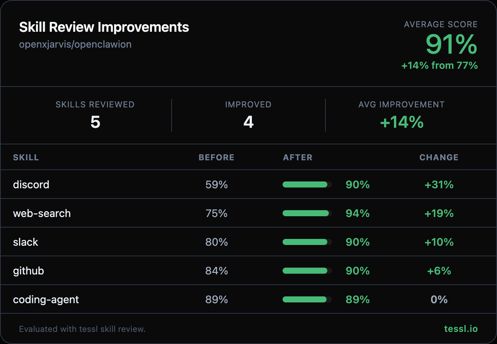

Hey @xjarvis 👋

I ran your skills through `tessl skill review` at work and found some targeted improvements. Here's the full before/after:

| Skill | Before | After | Change |
|-------|--------|-------|--------|
| discord | 59% | 90% | +31% |
| web-search | 75% | 94% | +19% |
| slack | 80% | 90% | +10% |
| github | 84% | 90% | +6% |
| coding-agent | 89% | 89% | 0% |

> **Note on discord**: The original `allowed-tools` field used an array format (`["message"]`) which caused a validation failure (score: 16%). I fixed it to a string (`"message"`) and re-scored to get a fair baseline of 59%. The content improvements then brought it up to 90%.

Changes summary

**discord** (+31%)
- Fixed `allowed-tools` from array to string format (validation fix)
- Expanded the description from a terse "Discord ops" to list all concrete actions (send, react, pin, poll, search, moderate) with a `Use when` clause
- Added safety guidance for destructive actions (delete/edit)

**web-search** (+19%)
- Replaced generic "Best Practices" and "Example Queries" sections with concrete tool invocation syntax (`web_search`, `web_fetch`)
- Added a decision workflow (URL → fetch, question → search then fetch, comprehensive → multi-source)
- Added error handling guidance (no results, fetch failures, rate limits)

**slack** (+10%)
- Expanded description with specific actions and natural trigger terms (`Use when` clause)
- Replaced "Ideas to try" fluff with safety guidance for destructive actions (delete/edit)

**github** (+6%)
- Condensed the verbose "When to Use" / "When NOT to Use" sections into a compact "Scope" block
- Added CI check validation step before PR merge in the workflow example

**coding-agent** (0% — already strong at 89%)
- Removed the "Learnings" section (repeated earlier content + haiku anecdote)
- Removed bash tool parameters and process tool actions tables (Claude knows its own interface)
- Cleaned up casual asides without losing the skill's personality

Honest disclosure — I work at @tesslio where we build tooling around skills like these. Not a pitch - just saw room for improvement and wanted to contribute.

Want to self-improve your skills? Just point your agent (Claude Code, Codex, etc.) at [this Tessl guide](https://docs.tessl.io/evaluate/optimize-a-skill-using-best-practices) and ask it to optimize your skill. Ping me - [@yogesh-tessl](https://github.com/yogesh-tessl) - if you hit any snags.

Thanks in advance 🙏
